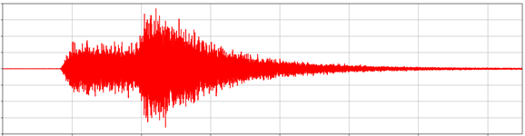
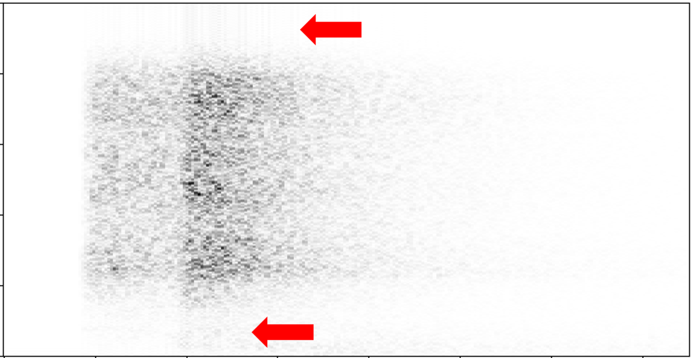
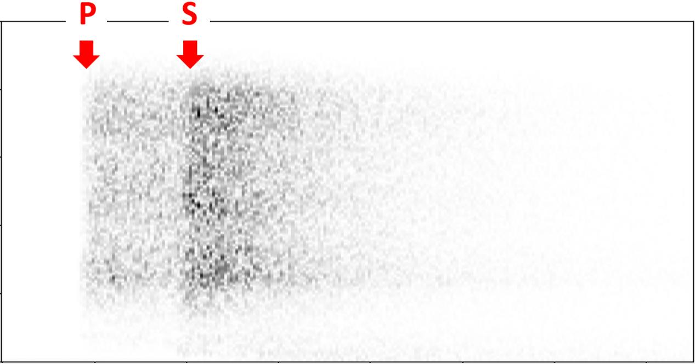
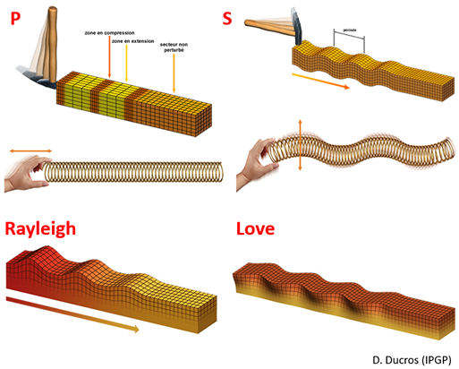

# Etape 4 : Traitement et analyse des données

Le 4 mai 2022, un séisme d’une magnitude estimée de 5 a été mesuré par SEIS. 
Nommé « S1222a », c’est le plus intense jamais détecté sur Mars. 
Contrairement à d’autres séismes importants mesurés par SEIS, il n’aurait pas pour origine un impact météoritique. 
Il s’agirait donc d’un évènement tectonique, qui a potentiellement déclenché des avalanches de poussière dans la région.

Vous trouverez [ici](https://github.com/NicOudart/UVSQ_M2_NewSpace_TP_mission_Insight/tree/main/example) un fichier hdf5 « Insight_SEIS_S1222a.h5 » contenant l'enregistrement de ce séisme par SEIS.

Vous allez écrire un script Python pour ouvrir, traiter et analyser les données des capteurs VBB (axes u,v,w) de SEIS contenant l’enregistrement du séisme S1222a.

Pour commencer, importez les bibliothèques suivantes :

~~~
import h5py
import numpy as np
import matplotlib.pyplot as plt
from scipy.signal import ShortTimeFFT
from scipy.signal.windows import *
from scipy.signal import butter, lfilter
~~~

Vous en aurez besoin dans cette partie du TP :

* h5py vous servira à importer les fichiers contenant les données (format hdf5).

* numpy vous servira à manipuler des matrices de données.

* matplotlib vous servira à afficher des graphiques.

* scipy.signal vous servira à fenêtrer / appliquer une STFT / filtrer un signal.

## Lecture et affichage des données

Ouvrez le fichier hdf5 avec la commande suivante, en remplaçant « path » par le chemin du fichier sur votre ordinateur :

~~~
hf = h5py.File('path')
~~~

Le fichier contient 4 vecteurs de données : ‘time’ contenant l’axe des temps (s) et ‘VBB_u’ / ‘VBB_v’ / ‘VBB_w’ contenant les mesures des axes u/v/w du capteur VBB (mm/s). 

Pour récupérer ces vecteurs, il faut utiliser les commandes :

~~~
t = hf.get('time')
vbb_u = hf.get('VBB_u')
vbb_v = hf.get('VBB_v')
vbb_w = hf.get('VBB_w')
~~~

t, vbb_u, vbb_v et vbb_w sont ici des objets de la librairie h5py, et ne sont pas directement utilisables pour des traitements / affichages. 
Il faut les convertir en numpy arrays avec les commandes suivantes : 

~~~
t = np.array(t)
vbb_u = np.array(vbb_u)
vbb_v = np.array(vbb_v)
vbb_w = np.array(vbb_w)
~~~

Vous pouvez maintenant afficher les données avec matplotlib. 
Voici par exemple pour vbb_u :

~~~
plt.plot(t,vbb_u,'r-')
plt.xlabel('…')
plt.ylabel('…')
plt.title('…')
plt.show()
~~~

* **Question 13 : Affichez sous la forme d’une figure le signal de VBB sur l’axe u, avec un titre et des légendes correctes.**

Vous devriez obtenir une série temporelle de la forme suivante :

* **Question 14 : Ce signal est-il causal ou acausal ? Est-il déterministe ou aléatoire ? Est-il périodique ou stationnaire ?**

## Analyse spectrale par FFT

Dans la suite, nous allons étudier le contenu en fréquences de ce signal.

Comme mentionné en partie 2, le pas de temps de ce signal discret est 0.05 s, et sa durée totale est de 1500 s.

* **Question 15 : Quelle est la plage de fréquences et la résolution d’un spectre obtenu après FFT de ce signal ?**

Pensez-vous qu’il soit pertinent d’appliquer directement la FFT à ce signal ?

Non, car la fréquence et l'amplitude de celui-ci varie au cours du temps.
Dans la suite, vous allez chercher à produire un spectrogramme de ce signal, une représentation plus adaptée pour son analyse.

## Analyse spectrale par STFT

Pour afficher un spectrogramme des données de SEIS, vous allez utiliser la fonction STFT de la bibliothèque Python « scipy ». 
Mais avant toute chose, il nous faut déterminer des paramètres pour cette fonction.

On sélectionne en général une puissance de 2 pour le nombre d’échantillons de la fenêtre glissante d’une STFT. 

* **Question 16 : Sachant que le pas de temps est de 0.05 s, quelle puissance de 2 minimum faut-il pour obtenir un spectrogramme avec une résolution fréquentielle inférieure à 0,1 Hz ?**

On ajoute aussi souvent un "overlap" à la fenêtre glissante pour "lisser" le spectrogramme.

* **Question 17 : Quel doit être le nombre d’échantillons entre 2 positions de la fenêtre pour avoir un « overlap » de 50 % ?**

Vous pouvez maintenant initialiser une fonction STFT avec la commande suivante :

~~~
STFT = ShortTimeFFT(win=np.ones(x),hop=y,fs=z,mfft=x*8,scale_to='magnitude')
~~~

Il faut remplacer x par le nombre d’échantillons dans la fenêtre glissante, y par le nombre d’échantillons entre 2 positions de la fenêtre, z par la fréquence d’échantillonnage du signal en Hz.
Le facteur 8 sur le paramètre « mfft » permet de réaliser une interpolation X8 par « zero-padding ». 
L’amplitude des spectrogrammes sera normalisée par la fonction.

Calculez le spectrogramme du signal de VBB mesuré pour l’axe u avec :

~~~
spec_vbb_u = STFT.stft(vbb_u)
~~~

Créez les vecteurs temps et fréquences correspondants à votre spectrogramme avec les commandes suivantes :

~~~
t_axis = np.linspace(0,T,np.shape(spec_vbb_u)[1])
f_axis = np.linspace(0,z/2,np.shape(spec_vbb_u)[0])
~~~

Il faut remplacer z par la fréquence d’échantillonnage du signal en Hz, et T par la durée total du signal en s.

Vous pouvez à présent afficher votre spectrogramme avec les commandes suivantes :

~~~
plt.pcolormesh(t_axis,f_axis,abs(spec_vbb_u),cmap='binary')
plt.xlabel('…')
plt.ylabel('…')
plt.colorbar()
plt.show()
~~~

Donnez des légendes pertinentes à votre figure.

Vous devez obtenir une figure de la forme suivante :

On observe comme des oscillations parasites au niveau des flèches rouges : 

* **Question 18 : A quoi correspondent ces artéfacts ?**

* **Question 19 : Pour réduire ces artéfacts en favorisant la résolution, quelle fenêtre choisiriez-vous entre Hann, Hamming et Blackman ?**

Vous pouvez créer une nouvelle fonction STFT avec votre fenêtre, en utilisant ré-utilisant la commande précédente :

~~~
STFT = ShortTimeFFT(win=hann(x),hop=y,fs=z,mfft=x*8,scale_to='magnitude')
~~~

Il faut remplacer "hann" par le nom de la fenêtre que vous avez choisie.

Appliquez cette nouvelle STFT au signal, et générez un nouveau spectrogramme avec des légendes correctes.

Vous devez obtenir une figure de la forme suivante :

## Analyse après filtrage

Les 2 types d’ondes visibles sur le spectrogramme arrivent à des temps différents car elles ne se propagent pas à la même vitesse dans le sol martien.  
D’où P comme « primaire », et S comme « secondaire ».
On utilise d’ailleurs souvent cette différence de temps d’arrivée pour mesurer la distance à l’épicentre du séisme.
Ces ondes sont des ondes de volume.

Après les ondes de volume, arrivent en général les ondes de surface.
Elles sont divisées en 2 catégories : ondes de Rayleigh et ondes de Love.
De par leur nature, ce sont ces ondes sismiques qui provoquent le plus de dégâts à la surface de la Terre.

Les ondes de surface ne sont pas visibles sur notre spectrogramme car masquées par les ondes de volume. 
Afin de les observer, nous allons donc devoir filtrer le signal.

Pour rappel, dans son article P. Lognonné donnait les caractéristiques fréquentielles des différentes ondes sismiques (« body waves » = ondes de volume) :

|Extrait 6|
|:-|
|"– […] body waves (in the short period range, 0.1–5 Hz)|
|– […] surface waves (in the long period range, 0.01–0.1 Hz)"|

* **Question 20 : Quel type de filtre utiliseriez-vous pour faire ressortir les ondes de surface et atténuer les ondes de volume ?**

* **Question 21 : Quelle(s) fréquence(s) de coupure choisiriez-vous ?**

Vous pouvez créer les coefficients de la partie non-récursive (b) et récursive (a) de votre filtre avec la commande suivante : 

~~~
b,a = butter(3,k,fs=z,btype='n')
~~~

Vous devez remplacer k par la fréquence de coupure du filtre (ou une liste s’il y en a plusieurs, en Hz), remplacer z par la fréquence d’échantillonnage du signal (en Hz), et n le nom du filtre que vous souhaitez utiliser (« lowpass » pour passe-bas, « highpass » pour passe-haut, « bandpass » pour passe-bande, « bandstop » pour coupe-bande).
Le paramètre 3 est l’ordre du modèle.

La fonction s’appelle « Butter » en référence à la technique de Butterworth utilisée pour générer le filtre.

Appliquez votre filtre aux données VBB de l’axe w avec la commande suivante :

~~~
vbb_w_filt = lfilter(b,a,vbb_w)
~~~

Vous pouvez ensuite afficher le signal de la même façon que précédemment :

~~~
plt.plot(t,vbb_w_filt,'r-')
~~~

Donnez alors des légendes pertinentes à votre figure.

On observe à présent les 2 types d’ondes de surface, indiquées par des flèches rouges. 

Le filtrage a aussi fait ressortir des pics, indiqués par des flèches vertes. 
Ce sont des artéfacts correspondant aux relaxations de l’instrument, qui est soumis à de forts contrastes de température sur Mars.

Pour aller plus loin :

* **Question bonus 1 : Essayez d'augmenter l'ordre du filtre. Quel est l'impact sur le résultat ? Pouvez-vous expliquer ce qui se passe ?**

* **Question bonus 2 : Essayez le même traitement sur les mesures des autres axes. Observez-vous la même chose ?**
